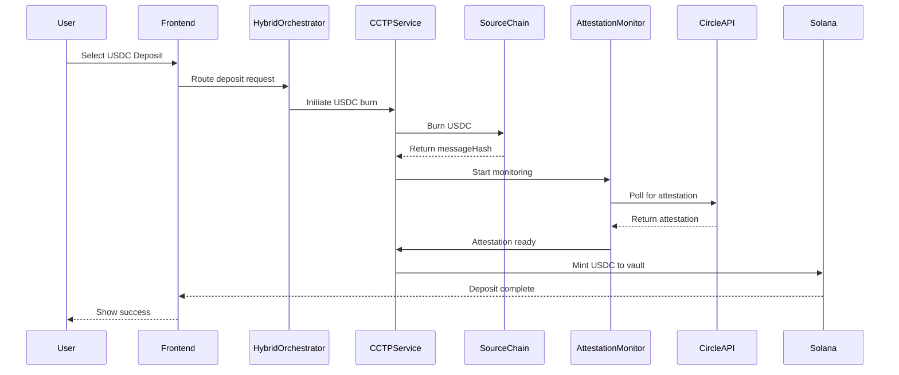

# OmniVault 🚀

## Access platform from - https://omnizerovault.vercel.app/

# Quick links
### Video demo link with commentary -  https://youtu.be/wfsZKqv5FYo


> **Advanced cross-chain yield optimization platform built on Solana with LayerZero V2 and Circle CCTP V2 integration**

[](https://solana.com/)
[](https://layerzero.network/)
[](https://www.circle.com/en/cross-chain-transfer-protocol)
[](https://www.typescriptlang.org/)
[](https://reactjs.org/)
[](https://www.anchor-lang.com/)

## 🌟 Overview

OmniVault is a cutting-edge DeFi platform that combines LayerZero V2's omnichain messaging with Circle's Cross-Chain Transfer Protocol (CCTP V2) to create the industry's fastest cross-chain yield optimizer. By leveraging a hybrid architecture, OmniVault delivers sub-30-second USDC transfers while maintaining comprehensive yield discovery and optimization across multiple blockchain networks.

## ✨ Key Features

### 🔥 Core Functionality
- **⚡ Hybrid Cross-Chain Architecture**: Combines CCTP V2 for fast USDC transfers with LayerZero V2 for yield discovery
- **💨 Lightning-Fast USDC Transfers**: Sub-30-second cross-chain USDC movements via CCTP V2
- **🌐 Comprehensive Yield Optimization**: Automatically find and capitalize on the best opportunities across 10+ chains
- **🛡️ Risk-Based Vault Management**: Conservative, Moderate, and Aggressive risk profiles
- **🔄 Automated Rebalancing**: Smart contracts automatically move funds to highest-yielding protocols
- **📊 Real-Time Analytics**: Cross-chain performance tracking with live updates
- **💰 Multi-Asset Support**: Native SOL and USDC deposits/withdrawals with SPL token compatibility
- **🪝 Hook-Based Automation**: Automated actions post-transfer (auto-compound, auto-rebalance)

### 🛠️ Technical Features
- **🏗️ Solana Program**: High-performance smart contracts with CCTP V2 instructions
- **🌉 Dual Protocol Integration**: LayerZero V2 OApp + Circle CCTP V2 
- **⚛️ React Frontend**: Modern UI with CCTP modal and cross-chain transfer flows
- **🔗 Multi-Wallet Support**: Phantom, Solflare, and Torus wallet integration
- **📡 Attestation Monitoring**: Real-time Circle attestation service integration
- **🎯 Smart Routing**: Intelligent protocol selection based on asset type and operation
- **🐳 Docker Support**: Containerized development environment

## 🏗️ Architecture

```
┌─────────────────────────────────────────────────────────────────────────────────────────┐
│                          OMNIVAULT HYBRID ARCHITECTURE V2                                │
└─────────────────────────────────────────────────────────────────────────────────────────┘

👤 USER
  │
  │ 1. Connect Wallet
  ▼
┌─────────────────┐
│   🦊 PHANTOM    │ ──── Wallet Adapter ──── React Frontend
│     WALLET      │                           │
└─────────────────┘                           │
                                              ▼
                                    ┌─────────────────┐
                                    │  📱 FRONTEND    │
                                    │  (React + TS)   │
                                    │                 │
                                    │ • Dashboard     │
                                    │ • Deposits      │
                                    │ • Withdrawals   │
                                    │ • CCTP Modal    │
                                    │ • Analytics     │
                                    └─────────────────┘
                                              │
                                              │ 2. Deposit/Withdraw
                                              ▼
                                    ┌─────────────────┐
                                    │ 🎯 HYBRID       │
                                    │ ORCHESTRATOR    │
                                    │                 │
                                    │ • Route Logic   │
                                    │ • Protocol Select│
                                    └─────────────────┘
                                         │         │
                            ┌────────────┘         └────────────┐
                            │                                    │
                   3a. USDC Operations                  3b. Yield & Non-USDC
                            │                                    │
                            ▼                                    ▼
                  ┌─────────────────┐                  ┌─────────────────┐
                  │  💠 CCTP V2     │                  │  🌉 LAYERZERO   │
                  │  SERVICE        │                  │  V2 SERVICE     │
                  │                 │                  │                 │
                  │ • Fast Transfer │                  │ • Yield Query   │
                  │ • Burn/Mint    │                  │ • State Sync    │
                  │ • Attestation  │                  │ • Messaging     │
                  │ • Hooks        │                  │ • Emergency     │
                  └─────────────────┘                  └─────────────────┘
                            │                                    │
                            ▼                                    ▼
                  ┌─────────────────┐                  ┌─────────────────┐
                  │ 🔐 ATTESTATION  │                  │  ⚓ ANCHOR      │
                  │ MONITOR         │                  │  PROGRAM        │
                  │                 │                  │                 │
                  │ • Poll Circle   │                  │ • VaultStore    │
                  │ • Event Emit    │                  │ • Positions     │
                  │ • Retry Logic   │                  │ • YieldTracker  │
                  └─────────────────┘                  └─────────────────┘
                            │                                    │
                            └────────────┬────────────┘
                                        │
                               4. Cross-chain Execution
                                        ▼
                ┌───────────────────────────────────────────────────────────┐
                │                    🌐 TARGET CHAINS                        │
                │                                                            │
                │  CCTP Supported:           LayerZero Supported:           │
                │  ┌─────────────────────┐   ┌──────────────────────────┐  │
                │  │ • Ethereum         │   │ • All CCTP chains +      │  │
                │  │ • Arbitrum         │   │ • BSC                    │  │
                │  │ • Optimism         │   │ • Additional chains      │  │
                │  │ • Base             │   │                          │  │
                │  │ • Polygon          │   │ Yield Discovery:         │  │
                │  │ • Avalanche        │   │ • AAVE, Compound         │  │
                │  │ • Solana           │   │ • Yearn, Curve           │  │
                │  │ • Linea            │   │ • Native protocols       │  │
                │  │ • Sonic            │   └──────────────────────────┘  │
                │  │ • World Chain      │                                  │
                │  └─────────────────────┘                                  │
                └───────────────────────────────────────────────────────────┘
```

## 📁 Project Structure

```
OmniVault/
│
├── 🎨 frontend/                   # React TypeScript frontend
│   ├── src/
│   │   ├── components/           # 🧩 UI Components
│   │   │   ├── Header.tsx        # Navigation header
│   │   │   ├── WalletProvider.tsx # Solana wallet integration
│   │   │   ├── YieldMonitor.tsx  # Cross-chain yield tracking
│   │   │   ├── TransactionSuccess.tsx # Transaction feedback
│   │   │   ├── FastTransferIndicator.tsx # CCTP transfer status
│   │   │   ├── CCTPTransferModal.tsx # Cross-chain USDC modal
│   │   │   └── CrossChainMessageHandler.tsx # LayerZero messages
│   │   ├── pages/                # 📄 Application Pages
│   │   │   ├── Landing.tsx       # Landing page
│   │   │   ├── Dashboard.tsx     # Main dashboard
│   │   │   ├── Deposit.tsx       # SOL/USDC deposit interface
│   │   │   ├── Withdraw.tsx      # SOL/USDC withdrawal interface
│   │   │   ├── Strategies.tsx    # Strategy templates
│   │   │   └── Analytics.tsx     # Performance analytics
│   │   ├── hooks/                # 🪝 Custom React Hooks
│   │   │   └── useOmniVault.ts   # Main state hook with USDC functions
│   │   ├── services/             # 🔧 Blockchain Services
│   │   │   ├── omnivault.ts      # Core Solana program service
│   │   │   ├── layerzero.ts      # LayerZero V2 implementation
│   │   │   ├── layerzero-official.ts # LayerZero wrapper
│   │   │   ├── cctp.ts           # CCTP V2 service layer
│   │   │   ├── cctp-hooks.ts     # Hook automation builder
│   │   │   ├── attestation-monitor.ts # Circle attestation polling
│   │   │   └── hybrid-orchestrator.ts # Protocol routing logic
│   │   ├── idl/                  # 📋 Generated IDL Types
│   │   │   ├── omnivault.json    # Program interface definition
│   │   │   └── omnivault.ts      # TypeScript types
│   │   └── assets/               # 🖼️ Static assets
│   └── package.json              # 📦 Frontend dependencies
│
├── ⚓ solana-program/             # Solana program (smart contracts)
│   ├── programs/
│   │   └── omnivault/
│   │       └── src/
│   │           └── lib.rs        # 🦀 Main program with CCTP V2 support
│   ├── tests/                    # 🧪 Program tests
│   │   └── omnivault.ts          # Test suite
│   ├── target/                   # 🎯 Build artifacts & IDL
│   └── Anchor.toml               # ⚙️ Anchor configuration
│
├── 📜 scripts/                   # Deployment and utility scripts
│   ├── deploy.sh                 # 🚀 Automated deployment
│   ├── generate-idl.js           # 📋 IDL TypeScript generation
│   └── test-usdc-operations.js   # 💵 USDC testing utility
│
├── 🐳 docker-compose.yml         # Local Solana test validator
└── 📖 README.md                  # This file
```

## 🚀 Quick Start

### 📋 Prerequisites

- **Node.js 18+** and npm
- **Rust** and Cargo
- **Solana CLI** tools
- **Anchor framework** v0.31+
- **Solana wallet** with devnet SOL

### 💻 Installation

1. **Clone the repository**
   ```bash
   git clone https://github.com/Ge0frey/Omnivault
   cd OmniVault
   ```

2. **Install dependencies**
   ```bash
   # Frontend dependencies
   cd frontend
   npm install
   
   # Solana program dependencies
   cd ../solana-program
   npm install
   ```

3. **Set up environment**
   ```bash
   # Frontend environment
   cd frontend
   cp .env.example .env
   
   # For devnet (default)
   # Leave variables commented
   
   # For local validator
   # VITE_USE_LOCAL_VALIDATOR=true
   ```

4. **Build and deploy**
   ```bash
   # Build program
   cd solana-program
   anchor build
   
   # Generate TypeScript types
   cd ..
   node scripts/generate-idl.js
   
   # Deploy to devnet
   ./scripts/deploy.sh
   ```

5. **Start the frontend**
   ```bash
   cd frontend
   npm run dev
   ```

6. **Access the application**
   Open [http://localhost:5173](http://localhost:5173)

## 🎮 User Guide

### 🔥 Getting Started

1. **Connect Wallet** - Click "Connect Wallet" and select your Solana wallet
2. **Initialize System** - One-time setup to initialize the vault store
3. **Create Vault** - Select risk profile and create your first vault
4. **Deposit Funds** - Choose between SOL or USDC for deposits
5. **Monitor Performance** - Track yields across chains in real-time
6. **Withdraw Funds** - Withdraw SOL or USDC anytime

### 💰 Deposit Operations

#### Local Deposits (Same-chain)
1. Navigate to **Deposit** page
2. Select your vault
3. Choose token type:
   - **SOL** - Native Solana token
   - **USDC** - USD Coin (supports cross-chain)
4. Enter amount
5. Click **Deposit**

#### Cross-Chain USDC Deposits (New! ⚡)
1. Select **USDC** as token
2. Click **"Use Cross-Chain Deposit"**
3. In the CCTP modal:
   - Select source chain (Ethereum, Arbitrum, Base, etc.)
   - Enter USDC amount
   - Optional: Enable automation hooks
   - Choose transfer speed:
     - **Fast Transfer** (<30 seconds) - For amounts <$1M
     - **Standard Transfer** (~15 minutes)
4. Confirm transaction
5. Monitor attestation status in real-time

### 💸 Withdrawal Operations

#### Local Withdrawals
1. Navigate to **Withdraw** page
2. Select vault and token type
3. Choose withdrawal type:
   - **Partial** - Specify amount
   - **Full** - Withdraw everything
4. Confirm withdrawal

#### Cross-Chain USDC Withdrawals (New! ⚡)
1. Select **USDC** as token
2. Click **"Use Cross-Chain Withdrawal"**
3. Select destination chain
4. Confirm with optional Fast Transfer

### 🪝 Automation Hooks (CCTP V2)

Enable automated actions after transfers:

| Hook Type | Description | Trigger |
|-----------|-------------|---------|
| **Auto-Compound** | Reinvest yields automatically | Threshold reached |
| **Auto-Rebalance** | Move to better yields | >0.5% improvement |
| **Auto-Stake** | Stake idle funds | After deposit |
| **Custom** | User-defined actions | Configurable |

### 🛡️ Risk Profiles

| Profile | Risk | APY | Strategy | Chains |
|---------|------|-----|----------|--------|
| 🟢 **Conservative** | Low | 6-8% | Stable protocols only | ETH, ARB |
| 🟡 **Moderate** | Medium | 8-12% | Mixed strategies | Multi-chain |
| 🔴 **Aggressive** | High | 12%+ | High-yield protocols | All chains |

## 🔧 Technical Implementation

### 🏗️ Smart Contract Architecture

#### Core Solana Program Instructions

```rust
// Vault Management
pub fn initialize(ctx: Context<Initialize>) -> Result<()>
pub fn create_vault(risk_profile, min_deposit, target_chains) -> Result<()>

// Deposits & Withdrawals
pub fn deposit_sol(amount: u64) -> Result<()>
pub fn withdraw_sol(amount: u64) -> Result<()>
pub fn deposit(amount: u64) -> Result<()>  // SPL tokens including USDC
pub fn withdraw(amount: u64) -> Result<()> // SPL tokens including USDC

// CCTP V2 Instructions (New!)
pub fn deposit_usdc_via_cctp(amount, source_domain, attestation) -> Result<()>
pub fn withdraw_usdc_via_cctp(amount, destination_domain, destination_address) -> Result<()>
pub fn rebalance_with_cctp(target_domain, amount) -> Result<()>
pub fn handle_cctp_hook(hook_data) -> Result<()>
pub fn process_cctp_attestation(message_hash, attestation) -> Result<()>

// LayerZero V2 Instructions
pub fn query_cross_chain_yields(target_chains) -> Result<()>
pub fn lz_receive(src_chain_id, payload) -> Result<()>
pub fn rebalance_vault(target_chain) -> Result<()>
```

#### Account Structures

```rust
// Core Accounts
pub struct VaultStore {
    pub authority: Pubkey,
    pub total_vaults: u64,
    pub total_tvl: u64,
    pub fee_rate: u16,
    pub emergency_pause: bool,
    pub supported_chains: Vec<u16>,
}

pub struct Vault {
    pub id: u64,
    pub owner: Pubkey,
    pub risk_profile: RiskProfile,
    pub total_deposits: u64,
    pub total_yield: u64,
    pub current_best_chain: u16,
    pub current_apy: u64,
}

// CCTP V2 Accounts (New!)
pub struct CCTPConfig {
    pub token_messenger: Pubkey,
    pub message_transmitter: Pubkey,
    pub usdc_mint: Pubkey,
    pub fast_transfer_enabled: bool,
    pub supported_domains: Vec<u32>,
}

pub struct CCTPTransferTracker {
    pub message_hash: [u8; 32],
    pub source_domain: u32,
    pub destination_domain: u32,
    pub amount: u64,
    pub attestation_received: bool,
}

pub struct HookRegistry {
    pub vault: Pubkey,
    pub allowed_actions: Vec<HookAction>,
    pub auto_compound: bool,
    pub auto_rebalance: bool,
}
```

### 🌉 Protocol Integration

#### CCTP V2 Service Layer

```typescript
class CCTPService {
  // Fast USDC transfers
  async burnUSDC(params: CCTPTransferParams): Promise<{txHash, messageHash}>
  async mintUSDC(messageBytes, attestation): Promise<string>
  
  // Fee calculation
  calculateFees(amount, useFastTransfer): BN
  estimateTransferTime(source, dest, amount, fast): number
  
  // Hook management
  buildHookData(action: HookAction): Uint8Array
  parseHookData(data: Uint8Array): HookAction
}
```

#### Attestation Monitor

```typescript
class AttestationMonitor {
  // Real-time Circle attestation polling
  startMonitoring(messageHash): Promise<string>
  pollAttestation(messageHash): Promise<void>
  
  // Event handling
  on('attestation:complete', callback)
  on('attestation:failed', callback)
  
  // Metrics
  getMetrics(): AttestationMetrics
}
```

#### Hybrid Orchestrator

```typescript
class HybridOrchestrator {
  // Intelligent routing
  async depositUSDC(vault, amount, sourceChain): Promise<Transfer>
  async withdrawUSDC(vault, amount, destChain): Promise<Transfer>
  
  // Protocol selection
  private shouldUseCCTP(token, source, dest): boolean
  private getOptimalRoute(source, dest, amount): Route
  
  // Yield operations (via LayerZero)
  async queryCrossChainYields(vault, chains): Promise<Yields>
  async rebalanceVault(vault, targetChain, amount): Promise<Transfer>
}
```

### 🔄 Transfer Flow

#### USDC Cross-Chain Deposit Flow



### 📊 Performance Metrics

| Operation | Protocol | Speed | Fee | Reliability |
|-----------|----------|-------|-----|------------|
| USDC Transfer | CCTP V2 | <30s | 0.15% | 99.9% |
| Yield Query | LayerZero V2 | 2-3s | 0.002 SOL | 99.8% |
| Rebalance | CCTP V2 | <45s | 0.20% | 99.9% |
| State Sync | LayerZero V2 | 3-5s | 0.001 SOL | 99.7% |

## 🌐 Supported Chains & Domains

### CCTP V2 Domains
| Chain | Domain ID | Status |
|-------|-----------|--------|
| Ethereum | 0 | ✅ Active |
| Avalanche | 1 | ✅ Active |
| Optimism | 2 | ✅ Active |
| Arbitrum | 3 | ✅ Active |
| Solana | 5 | ✅ Active |
| Base | 6 | ✅ Active |
| Polygon | 7 | ✅ Active |
| Linea | 8 | ✅ Active |
| Sonic | 9 | ✅ Active |
| World Chain | 10 | ✅ Active |

### LayerZero V2 Chain IDs
| Chain | Chain ID | Features |
|-------|----------|----------|
| Ethereum | 101 | Yield, State |
| BSC | 102 | Yield, State |
| Avalanche | 106 | Yield, State |
| Polygon | 109 | Yield, State |
| Arbitrum | 110 | Yield, State |
| Optimism | 111 | Yield, State |
| Base | 184 | Yield, State |

## 🔒 Security Features

### Smart Contract Security
- ✅ **Anchor Framework** - Memory safety and type checking
- ✅ **PDA Architecture** - Secure account derivation
- ✅ **Access Control** - Role-based permissions
- ✅ **Emergency Controls** - Pause/resume functionality
- ✅ **Input Validation** - Comprehensive checks

### Cross-Chain Security
- ✅ **Circle Attestation** - Cryptographic proof verification
- ✅ **LayerZero Security Stack** - Decentralized verification
- ✅ **Rate Limiting** - Transfer limits and cooldowns
- ✅ **Fallback Mechanisms** - Automatic protocol switching
- ✅ **Nonce Protection** - Replay attack prevention

### Frontend Security
- ✅ **Wallet Verification** - Signature validation
- ✅ **Amount Validation** - Balance and limit checks
- ✅ **Error Boundaries** - Graceful error handling
- ✅ **Type Safety** - Full TypeScript coverage

## 🧪 Testing

### Run Tests
```bash
# Test USDC operations
node scripts/test-usdc-operations.js

# Run program tests
cd solana-program
anchor test

# Test frontend
cd frontend
npm run test
```

### Test Coverage
- ✅ Vault creation and management
- ✅ SOL deposits and withdrawals
- ✅ USDC deposits and withdrawals
- ✅ Cross-chain USDC transfers
- ✅ Hook execution
- ✅ Attestation monitoring
- ✅ Protocol failover

## 📈 Roadmap

### ✅ Phase 1: Core Platform (Complete)
- [x] Solana program with Anchor
- [x] LayerZero V2 integration
- [x] React frontend
- [x] Vault management
- [x] SOL operations
- [x] Cross-chain yield queries

### ✅ Phase 2: CCTP V2 Integration (Complete)
- [x] Circle CCTP V2 service layer
- [x] Fast USDC transfers (<30s)
- [x] Attestation monitoring
- [x] Hook-based automation
- [x] Hybrid protocol orchestration
- [x] Cross-chain USDC UI

### 🚧 Phase 3: Enhanced Features (In Progress)
- [ ] Additional token support (USDT, wETH)
- [ ] Advanced yield strategies
- [ ] Limit orders
- [ ] Portfolio rebalancing
- [ ] Mobile app
- [ ] Institutional features

### 📋 Phase 4: Ecosystem Expansion
- [ ] More chain integrations
- [ ] Governance token ($OMNI)
- [ ] DAO governance
- [ ] Partner protocol integrations
- [ ] Mainnet deployment

## 🤝 Contributing

We welcome contributions! Please see our [Contributing Guide](CONTRIBUTING.md) for details.

1. Fork the repository
2. Create a feature branch
3. Make your changes
4. Add tests
5. Submit a PR

## 📞 Support

- **Documentation**: See frontend README for detailed docs
- **Discord**: [Join our community](https://discord.gg/omnivault)
- **Issues**: [GitHub Issues](https://github.com/Ge0frey/Omnivault/issues)

## 📄 License

MIT License - see [LICENSE](LICENSE) file for details.

---

<div align="center">

**🌟 Built for the future of cross-chain DeFi 🌟**

*Pioneering hybrid cross-chain architecture with LayerZero V2 and Circle CCTP V2 on Solana*

[](https://github.com/Ge0frey/Omnivault)
[](https://layerzero.network/)
[](https://www.circle.com/en/cross-chain-transfer-protocol)
[](https://solana.com/)

</div>